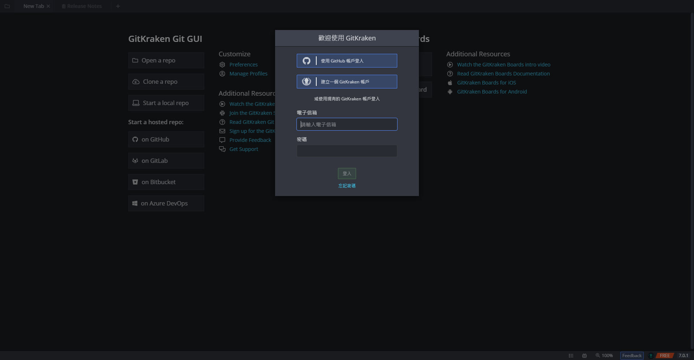
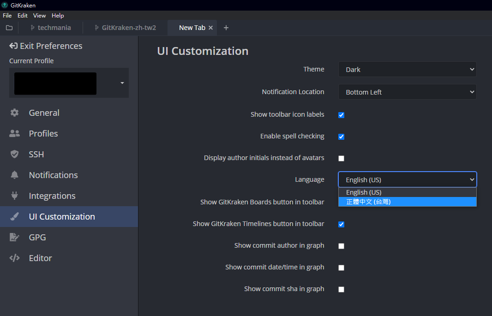

# GitKraken 正體中文 (台灣) 翻譯

[GitKraken](https://www.gitkraken.com/) 正體中文 (台灣) 翻譯補丁  
目前以緩慢速度翻譯中，8.9.1 除部分 Npm 與 Yarn 指令說明外其他皆翻譯完畢  
  

## 使用方法
- 目前支援版本: 8.9.1
- 至 [Release](https://github.com/rogeraabbccdd/GitKraken-zh-tw/releases) 下載 `strings.json`
- 取代檔案
  - Windows: `%LOCALAPPDATA%\gitkraken\app-8.9.1\resources\app.asar.unpacked\src\strings.json`
  - Mac: `/Applications/GitKraken.app/Contents/Resources/app.asar.unpacked/src/strings.json`
  - Linux: `/usr/share/gitkraken/resources/app.asar.unpacked/src`
- 重新開啟 GitKraken 後，至 Preference -> UI Customization -> Language 切換語言
  

## 更新翻譯檔格式
當新版本 GitKraken 發佈時，請使用 `update.js` 將翻譯檔更新為新版本的格式，避免使用時出現問題    
- 安裝 [Node.js](https://nodejs.org/en/)
- 下載 `update.js` 到翻譯檔資料夾
- 將新版的英文 `strings.json` 重新命名為 `strings.en.json`
- 將未更新的中文翻譯檔 `strings.json` 放入資料夾
- 用終端機開啟翻譯檔資料夾，執行 `node update.js`

## 翻譯參考
- [VSCode 繁體中文語言包](https://github.com/microsoft/vscode-loc/tree/master/i18n/vscode-language-pack-zh-hant)
- [k-skye 的 gitkraken-chinese](https://github.com/k-skye/gitkraken-chinese)
- [gitg 繁體中文 (台灣) 翻譯](https://gitlab.gnome.org/GNOME/gitg/-/blob/master/po/zh_TW.po)
- [《Pro Git》第二版中文文件翻譯對照表與規範](https://gist.github.com/fntsrlike/cf1e96d60b6f34fab725599b06dfcb2a)
